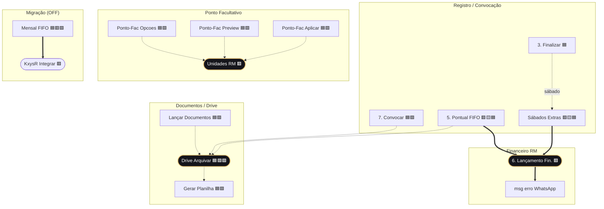
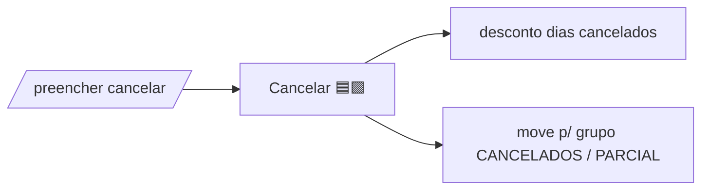
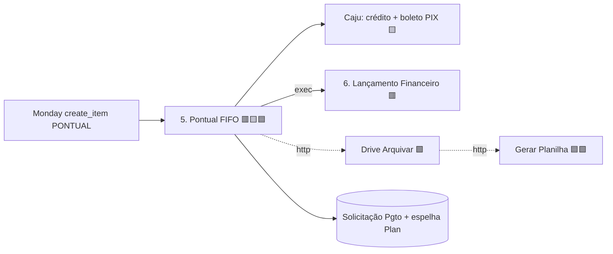
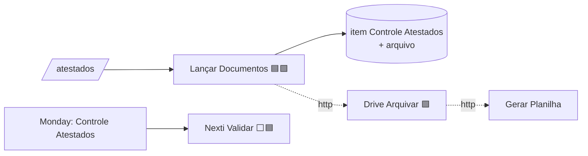
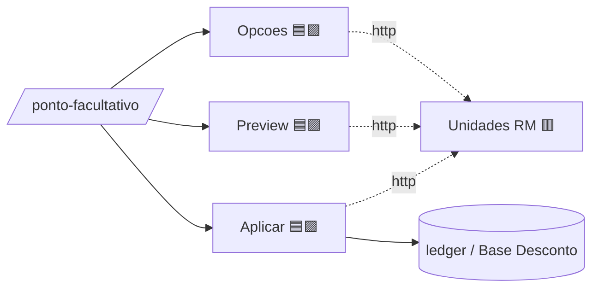
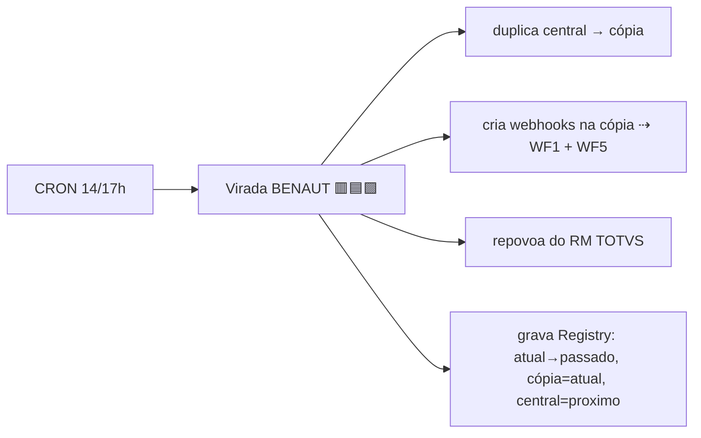

# 🗺️ Mapa Completo das Automações — Intermitentes

> Mapeamento de TODAS as automações n8n: o que cada uma faz, por que existe, ferramentas que usa e — principal — **como elas se conectam** pra formar cada processo. Cada ficha (§5) tem o **fluxo interativo** do WF (clique nos nodes). Minerado dos WFs vivos em `aionscorp-n8n.cloudfy.live`.
> **Arquitetura, boards, registry, Vercel e acessos** → ver **Visão & Plataforma**. **Estado/fixes/pendências e guia do DP** → ver **Operação & DP**.

---

## 0. Changelog

> Registrar aqui toda mudança em WF/conexão/ferramenta. Formato: `data — WF — o que mudou (impacto)`. Após mudar WFs, re-minerar (`node .wfmine/analyze.cjs`) e atualizar §2/§3/§5/§6.

| Data | WF / área | Mudança | Impacto |
|---|---|---|---|
| 2026-06-25 | — | **Criação do MAPA** (minerado dos 32 WFs vivos) | doc inicial |
| 2026-06-24 | Ponte AIONS RM | porta movida 8000→**8077** (conflito com motor-fiscal) | RM voltou online (era 404) |
| 2026-06-24 | rY4 CAJU Mensal | `Lotes RM` (SplitInBatches 50) + retry no envio RM | folha grande (199+) não cai mais |
| 2026-06-24 | rY4 CAJU Mensal | mobilidade por contrato base (79/15/11.02), não código exato | TRE PB/SEDUC INTERIOR → mobilidade correto |
| 2026-06-24 | rY4 + bph9 | Data Vencimento vem da planilha (A2), não = emissão | vencimento RM correto |
| 2026-06-24 | Drive Arquivar | 3 fixes (state-overwrite, binary key, upload nó nativo+retry) | boleto/comprovante anexa de novo |
| 2026-06-24 | WF5 Pontual | webhooks `create_item` recriados (junho/julho) + retry boleto encodedImage | pontual voltou a disparar |
| 2026-06-23 | bph9 / KxysR | fix `chapaPivot`→`chapasXmlSelecao` (todas as chapas) | lançamento soma todos, não 1 pessoa |
| 2026-06-23 | krRj3 Mensal (migração) | board dinâmico via Registry + adaptador `mode:each`→KxysR | em prep (OFF) |

---

## 1. Legenda & convenções

> Visão geral da arquitetura (4 camadas) está em **Visão & Plataforma**. Aqui, as convenções usadas neste mapa.

### Ferramentas externas (badges)
| Badge | Ferramenta | Como acessa |
|---|---|---|
| 🟥 **RM** | TOTVS RM (folha) | ponte AIONS `headed-shawl-annex.ngrok-free.dev` (`/consultar-rm`, `/enviar-rm`, `/executar-processo-rm`) |
| 🟨 **Caju** | Caju (benefício) | `services.caju.com.br` + `auth.caju.com.br` |
| 🟦 **Monday** | Monday boards | `api.monday.com` ou nó `mondayCom` |
| 🟩 **Drive** | Google Drive | nó `googleDrive` / `googleapis.com` |
| 🟪 **Registry** | Registry de boards | `plan-intermitente-ocorrencia.vercel.app/api/boards/resolver` |
| ⬜ **Nexti** | Nexti (ponto) | API Nexti (valida atestado) |

### Convenção de conexão
- **`▸`** = gatilho (front / Monday / cron).
- **`⇢ http`** = um WF chama outro via **HTTP** no webhook (fire-and-forget ou aguarda resposta).
- **`→ exec`** = um WF chama outro como **sub-workflow** (executeWorkflow, aguarda retorno).

---

## 2. Índice de WFs (42 intermitente-related; 32 fichados)

| WF | ID | Gatilho | Ferramentas | Estado |
|---|---|---|---|---|
| 1. Preparar | `rkIBahkH1h7cqnzE` | POST `Intermitentehaha` (Monday ativar) | 🟦🟪 | ON |
| 2. Ler | `WHtIQDf8oOWinGyx` | GET `intermitente-ler` | 🟦 | ON |
| 3. Finalizar | `rlxTk4VZLM2gTzx7` | POST `intermitente-finalizar` | 🟦 ⇢Sábados | ON |
| 4. Buscar Protocolo | `m5GIJMo0ghgSGbh2` | GET `intermitente-buscar-protocolo` | 🟦 | ON |
| 5. Pontual FIFO | `E1XAdrEbPy5lZhNS` | POST `intermitentes/pontual` | 🟥🟨🟦 →WF6 ⇢Drive | ON |
| 6. Lançamento Financeiro | `NdUSkYcRT4DkKfzW` | sub-workflow | 🟥 →WhatsApp(erro) | ON |
| 7. Convocar | `dX8OZzxr6sh0Upug` | POST `intermitente-convocar` | 🟦🟪 ⇢Drive | ON |
| 8. Buscar Empregado RM | `Dt0p1T6OZECuXRiI` | GET `convocar-buscar-empregado` | 🟥 | ON |
| 9. Opcoes convocação | `EImlFizH4jDgxW1Z` | GET `intermitente-convocar-opcoes` | 🟦🟥 ⇢Unidades | ON (legado) |
| Cancelar Convocação | `sbKoeewbkS7LNORH` | POST `intermitente-cancelar-convocacao` | 🟦🟪 | ON |
| Aplicar Split | `ZagUa2yuP6BsAE9i` | POST `intermitente-aplicar-split` | 🟦 | ON |
| Buscar Convocações Empregado | `8l69E6Z9ouZAL027` | GET `intermitente-convocacoes-empregado` | 🟦🟪 | ON |
| Lançar Documentos | `kVpn69JFUJfR7T7U` | POST `intermitente-lancar-documentos` | 🟦🟩 ⇢Drive | ON |
| Nexti Validar Atestado | `6efSZQYzLaP304rn` | POST `nexti-validar-atestado` | 🟦⬜ | ON |
| Drive Arquivar | `XRdAYO9dx2jSU8ps` | POST `drive-intermitente-arquivar` | 🟦🟩🟪 ⇢Planilha | ON |
| Gerar Planilha Conferência | `aBXCqYHPtZNjDMOM` | POST `gerar-planilha-conferencia` | 🟦🟩 | ON |
| Feriados | `QzZ02GGqjs9udBe2` | GET `intermitente-feriados` | 🟦 | ON |
| Unidades RM | `OggzTr5xRYc6s3NV` | webhook `intermitente-unidades-rm` | 🟥 | ON |
| Celetista Buscar Empregado | `0ljExfCN6OUFsHWp` | GET `celetista-buscar-empregado` | 🟥 | ON |
| Sábados Extras | `3TAyDuKFkWGvXTHT` | POST `sabados-extras-boleto` | 🟥🟨🟦🟪 →WF6 | ON |
| Descontos — Gerar Link | `BCgD9f1b3tKebluP` | POST `descontos-gerar-link` | 🟦🟪 | ON |
| Descontos — Ler | `EXuqosXXOSQNlmqY` | GET `descontos-ler` | 🟦 | ON |
| Descontos — Registrar | `sr4xxXLxmZ8EMURF` | POST `descontos-registrar-manual` | 🟦 | ON |
| Ponto-Fac Opcoes | `JXpJ6xuSZMcu2IVn` | GET `ponto-facultativo-opcoes` | 🟦🟪 ⇢Unidades | ON |
| Ponto-Fac Preview | `7gHmbLcZ5r6D5sXz` | POST `ponto-facultativo-preview` | 🟦🟪 ⇢Unidades | ON |
| Ponto-Fac Aplicar | `XybrfnzI11Fw5sX4` | POST `ponto-facultativo-aplicar` | 🟦🟪 ⇢Unidades | ON |
| Virada de Mês (BENAUT) | `gm2Ie8pbR2rOK5id` | CRON `0 17 14 * *` | 🟥🟦🟪 ⇢WF1+WF5 | **OFF** |
| Mensal Intermitente FIFO | `krRj3mXCM3F1CCYN` | (em prep) | 🟦🟥🟪 →KxysR | **OFF** |
| Integrar Financeiro Mensal (KxysR) | `KxysRgnlmi9bkCJM` | sub-workflow | 🟥 | **OFF** |

> Periféricos não-core (rentabilidade, checklists, SESMT readaptação, celetista) ficam fora das fichas detalhadas.

---

## 3. Grafo global de conexões

> Mostra só as conexões **WF → WF** (os "fios" entre automações). Setas: **`==>`** = sub-workflow (exec) · **`-.->`** = http webhook. Quem dispara cada cadeia (front/Monday/cron) está em **§4 (processos)** e **§7 (Front→WF)** — fora daqui de propósito, pra não poluir. Note os **hubs** que vários WFs convergem: `Drive Arquivar`, `WF6`, `Unidades RM`. (CAJU/bph9 = pagamento em massa, mapeado à parte.)



> WFs **sem aresta cross-WF** (folha — só front/Monday → WF): `1. Preparar`, `2. Ler`, `4. Buscar Protocolo`, `8/Celetista Buscar RM`, `Cancelar`, `Aplicar Split`, `Buscar Convocações`, `Nexti`, `Feriados`, `Descontos (3)`. Veja-os em §5/§7.

**Fallback ASCII (núcleo das conexões cross-WF):**
```
3.Finalizar  ─sábado⇢  Sábados Extras ═exec⇒ WF6 Lançamento(RM) ═⇒ msg erro WhatsApp
5.Pontual FIFO ═exec⇒ WF6 Lançamento(RM)
5.Pontual FIFO ─http⇢ ┐
7.Convocar     ─http⇢ ├─► Drive Arquivar ─http⇢ Gerar Planilha   (HUB Drive)
Lançar Docs    ─http⇢ ┘
Ponto-Fac Opcoes/Preview/Aplicar ─http⇢ Unidades RM   (HUB RM)
Virada BENAUT (OFF) ─http⇢ 1.Preparar + 5.Pontual
Mensal FIFO (OFF)   ═exec⇒ KxysR Integrar (RM)

HUBS (convergência): Drive Arquivar · WF6 · Unidades RM
```

---

## 4. Processos end-to-end (as cadeias)

### P1 — Convocação  `/convocar`
**O que é:** criar a convocação de um intermitente no board do mês.
```mermaid
flowchart LR
  A[/convocar/] --> B[8. Buscar Empregado RM 🟥]
  A --> C[7. Convocar 🟦🟪]
  C --> D{tem termo?}
  D -- sim --⇢--> E[Drive Arquivar 🟩]
  C --> F[(item criado<br/>grupo PONTUAL)]
```
ASCII: `/convocar ▸ WF8 (RM busca empregado) → WF7 Convocar (Registry resolve board → cria item Entrada + antifraude período) ⇢ Drive Arquivar (termos)`
- **WF8** lê empregado no RM (nome→dados). **WF7** resolve board via Registry, cria item no grupo PONTUAL, checa conflito de período, e se tiver termo dispara **Drive Arquivar**.
- Ferramentas: 🟥RM (busca) · 🟦Monday (cria item) · 🟪Registry (board do mês) · 🟩Drive (termos).

### P2 — Ativar → Registro de ocorrência  (falta/atraso) — **o "processo simples de 3 WFs"**
```mermaid
flowchart LR
  M[Monday: muda col. ativar] --> W1[1. Preparar 🟦🟪]
  W1 --> H[(cria item Histórico<br/>+ UUID + link)]
  L[/preencher link/] --> W2[2. Ler 🟦]
  L --> W3[3. Finalizar 🟦]
  W3 --> S{sábado extra?}
  S -- sim --⇢--> SB[Sábados Extras 🟥🟨🟦]
  SB --exec--> W6[6. Lançamento Financeiro 🟥]
```
ASCII: `Monday ativar ▸ WF1 Preparar (cria Histórico+link) → DP abre /preencher ▸ WF2 Ler (carrega) + WF3 Finalizar (desconto faltas/atrasos) [⇢ Sábados Extras → WF6 RM]`
- **WF1** cria o item no Histórico + UUID + grava o link `/preencher` na Entrada. **WF2** popula o formulário. **WF3** calcula desconto (faltas/atrasos), grava Base Desconto + Histórico, espelha no Plan; se teve sábado extra, dispara **Sábados Extras** → **WF6** (boleto VT no RM/Caju).
- É o registro completo: **3 WFs no caminho feliz (1+2+3)**, +2 se tiver sábado (Sábados+WF6).

### P3 — Cancelamento  `/preencher` (ícone cancelar)

ASCII: `/preencher ▸ Cancelar (Registry acha board do item → status Cancelada/parcial + desconto + move grupo)`
- 1 WF, mas faz muito: lê UUID, decide desconto, atualiza Histórico+Entrada, executa desconto GraphQL, move o item pro grupo CANCELADOS/CANCELADOS PARCIAL (Registry). **Cancelamento SEMPRE desconta** (inclusive DETRAN/TRE).

### P4 — Pontual / pagamento  (núcleo financeiro pontual)

ASCII: `create_item ▸ WF5 Pontual (Valores→VR/VT, FIFO Base Desconto, Caju crédito+boleto, WF6 RM idVR/idVT, Solicitação Pgto, espelha Plan) ⇢ Drive Arquivar ⇢ Gerar Planilha`
- WF mais pesado (56 nós). Toca 🟥RM + 🟨Caju + 🟦Monday + 🟩Drive. Retry de boleto (encodedImage async).

### P6 — Atestados / declarações  `/atestados`

ASCII: `/atestados ▸ Lançar Documentos (cria item Controle + anexa, loop multi-doc) ⇢ Drive Arquivar ⇢ Planilha` · paralelo: `Monday automation ▸ Nexti Validar (cruza CPF×ponto Nexti → desconto atestado)`

### P7 — Ponto Facultativo  `/ponto-facultativo` (DP/Admin)

ASCII: `Opcoes (unidades+contagem) / Preview (afetados+valores) / Aplicar (grava ledger) — os 3 ⇢ Unidades RM. DETRAN/TRE = não descontam.`

### P8 — Descontos manuais (retirada Caju)
ASCII: `Monday (botão Base Desconto) ▸ Gerar Link → /descontos ▸ Ler (mostra) + Registrar (grava VR/VT retirado)`

### P9 — Virada de mês  (BENAUT, dia 14 17h) — **OFF até ligar**

ASCII: `cron ▸ BENAUT (duplica central, recria webhooks ativar/create_item, arquiva+renomeia+repovoa do RM, grava Registry virada). Convocar funciona em atual+proximo.`

### P10 — Mensal Intermitente (migração, **OFF/em prep**)
ASCII: `krRj3 FIFO (board dinâmico via Registry, lê Plan) → KxysR Integrar (SOAP RM, 1×/contrato mode:each). Falta: webhook trigger + frontend. Ver ESTADO-ATUAL §7-8.`

---

## 5. Fichas completas por WF

> Cada ficha: **Função** · **Por quê** · **Gatilho** · **Ferramentas** · **Entradas/Saídas** · **Conexões** · **Nós-chave**.

### 1. Preparar — `rkIBahkH1h7cqnzE` 🟦🟪 ON
- **Função:** ao mudar a coluna `ativar` no item da Entrada, cria o item no board **Histórico** com UUID + protocolo + gera o **link `/preencher`** e grava na Entrada. Checa conflito de período.
- **Por quê:** é a ponte entre "convocação criada" e "registro de ocorrência" — sem ele não há link pro RH preencher.
- **Gatilho:** POST `/webhook/Intermitentehaha` (webhook Monday na coluna `ativar` = `color_mm2pxmak`).
- **Entradas:** evento Monday (boardId, pulseId). **Saídas:** item Histórico + link na Entrada.
- **Conexões:** chamado por **Monday** (e pela Virada). Não chama outro WF.
- **Nós-chave:** Get item origem · Criar item histórico · Atualizar Link Column · Checar conflito · Resolver Contexto Board (Registry).

### 2. Ler — `WHtIQDf8oOWinGyx` 🟦 ON
- **Função:** lê uma convocação por UUID (dados + respostas dia-a-dia + split + atestados) pra popular o formulário `/preencher`.
- **Por quê:** o front precisa carregar o estado atual da convocação ao abrir o link.
- **Gatilho:** GET `/webhook/intermitente-ler?uuid=`.
- **Conexões:** chamado pelo **front** `/preencher`.
- **Nós-chave:** Buscar por UUID · Anexar Split · Anexar Atestados Controle.

### 3. Finalizar — `rlxTk4VZLM2gTzx7` 🟦 ⇢Sábados ON
- **Função:** finaliza o registro: calcula desconto (faltas/atrasos), grava Histórico + Base Desconto, espelha no Plan, gera protocolo; se houve sábado extra dispara o boleto.
- **Por quê:** é onde o registro vira efeito financeiro (desconto de benefício).
- **Gatilho:** POST `/webhook/intermitente-finalizar`.
- **Conexões:** chamado pelo **front** `/preencher`; **⇢ http Sábados Extras** (se sábado extra).
- **Nós-chave:** Decidir Desconto · Executar Desconto GraphQL · Atualizar Plan Falta/Atraso · Preparar/Executar Subitems Split · Anexar Feriados.
- **Obs:** DETRAN/TRE PB **não descontam** por falta/atestado.

### 4. Buscar Protocolo — `m5GIJMo0ghgSGbh2` 🟦 ON
- **Função:** dado um protocolo `PROT-XXXX-XXXX`, retorna o UUID pra reabrir o registro.
- **Gatilho:** GET `/webhook/intermitente-buscar-protocolo`. **Conexão:** front `/corrigir`.

### 5. Pontual FIFO — `E1XAdrEbPy5lZhNS` 🟥🟨🟦 →WF6 ⇢Drive ON
- **Função:** núcleo do pagamento pontual — calcula VR/VT do período (board Valores), abate dívidas FIFO (Base Desconto), cria pedido **Caju** (crédito + boleto PIX), lança no **RM** (via WF6), cria Solicitação de Pagamento, espelha no Plan, arquiva no Drive.
- **Por quê:** transforma a convocação pontual em pagamento real (Caju) + lançamento de folha (RM).
- **Gatilho:** POST `/webhook/intermitentes/pontual` (webhook Monday `create_item` no grupo PONTUAL).
- **Conexões:** **→ exec WF6** (Lançamento Financeiro RM) · **⇢ http Drive Arquivar** (boleto/comprovante).
- **Nós-chave (56):** Caju OAuth/criar/confirmar PIX · Buscar Pedido Caju Boleto (+retry `Esperar Boleto Caju`) · Preparar Arquivos Caju Drive · Registrar Debito Controle Caju · Setar Status AUTOMACAO-OK · Buscar Feriados.

### 6. Lançamento Financeiro — `NdUSkYcRT4DkKfzW` 🟥 ON (sub)
- **Função:** monta e envia o SOAP do RM (FopRotinas) por evento 100=VR/110=VT; retorna idVR/idVT.
- **Por quê:** centraliza a escrita no RM pros fluxos pontual e sábados.
- **Gatilho:** sub-workflow. **Chamado por:** WF5 Pontual, Sábados Extras. **Chama:** Msg erro WhatsApp (só em falha).

### 7. Convocar — `dX8OZzxr6sh0Upug` 🟦🟪 ⇢Drive ON
- **Função:** cria o item da convocação na Entrada (grupo PONTUAL), com antifraude de período; **resolve board/grupo/colunas via Registry** (mês atual/próximo); faz upload dos termos.
- **Por quê:** porta de entrada de toda convocação; precisa acertar o board do mês certo (virada).
- **Gatilho:** POST `/webhook/intermitente-convocar`. **Conexões:** front `/convocar`; **⇢ http Drive Arquivar**.
- **Nós-chave:** Resolver Board · Criar item entrada · Buscar/Checar conflito · Disparar Drive Convocacao Async.

### 8. Buscar Empregado RM — `Dt0p1T6OZECuXRiI` 🟥 ON
- **Função:** autocomplete de empregado no RM (SQL BEN 2) por nome. **Gatilho:** GET `convocar-buscar-empregado`. **Conexão:** front `/convocar` e `/atestados`.

### 9. Opcoes convocação — `EImlFizH4jDgxW1Z` 🟦🟥 ⇢Unidades ON (legado)
- **Função:** labels dos selects + unidades por contrato. **OBSOLETO** — substituído por `/api/convocar/opcoes` no backend; ainda ON (legado VM).

### Cancelar Convocação — `sbKoeewbkS7LNORH` 🟦🟪 ON
- **Função:** cancela (total/parcial), aplica desconto dos dias cancelados, move o item pro grupo CANCELADOS/PARCIAL (Registry).
- **Gatilho:** POST `intermitente-cancelar-convocacao`. **Conexão:** front `/preencher`.
- **Nós-chave:** Decidir Desconto · Executar Desconto GraphQL · Mover para grupo cancelado · Resolver Board Cancelar.

### Aplicar Split — `ZagUa2yuP6BsAE9i` 🟦 ON
- **Função:** grava o Split JSON de benefício no Histórico. **Gatilho:** POST `intermitente-aplicar-split`. **Conexão:** front `/preencher`.

### Buscar Convocações Empregado — `8l69E6Z9ouZAL027` 🟦🟪 ON
- **Função:** lista convocações do empregado no mês (board atual via Registry), cruzando Entrada×Histórico. **Gatilho:** GET `intermitente-convocacoes-empregado`. **Conexão:** front `/atestados`.

### Lançar Documentos — `kVpn69JFUJfR7T7U` 🟦🟩 ⇢Drive ON
- **Função:** cria item no board **Controle de Atestados** + anexa arquivo (loop multi-documento) e arquiva no Drive.
- **Gatilho:** POST `intermitente-lancar-documentos` (multipart). **Conexões:** front `/atestados`; **⇢ http Drive Arquivar**.
- **Nós-chave:** Loop Documentos · Criar Item Controle · Anexar arquivo · Disparar Drive Atestado Async.

### Nexti Validar Atestado — `6efSZQYzLaP304rn` 🟦⬜ ON
- **Função:** valida o atestado contra o ponto real na **Nexti** (por CPF/datas) e lança o desconto de atestado no Monday.
- **Gatilho:** POST `nexti-validar-atestado` (Monday automation no Controle de Atestados).
- **Nós-chave:** Nexti OAuth · GET persons/absences/absencesituations · Montar Mutacoes Desconto Atestado.

### Drive Arquivar — `XRdAYO9dx2jSU8ps` 🟦🟩🟪 ⇢Planilha ON
- **Função:** cria a árvore de pastas no Drive (por ano/mês/contrato/pessoa/período) e faz upload do boleto/comprovante; dispara a planilha de conferência.
- **Por quê:** centraliza o arquivamento documental de todos os fluxos (pontual, convocar, atestados).
- **Gatilho:** POST `drive-intermitente-arquivar`. **Chamado por:** WF5, WF7, Lançar Documentos. **⇢ http Gerar Planilha**.
- **Nós-chave:** Preparar Arquivamento Drive (normaliza binário→`data`, monta `ensurePaths`) · loop criar/resolver pasta · **Upload Arquivo Drive (nó nativo googleDrive, retry 5×)** · Resolver Board.
- **Obs:** 3 bugs corrigidos (ver ESTADO-ATUAL §7).

### Gerar Planilha Conferência — `aBXCqYHPtZNjDMOM` 🟦🟩 ON
- **Função:** gera XLSX com todas as colunas do item do board → pasta CONFERENCIA. **Gatilho:** POST `gerar-planilha-conferencia`. **Chamado por:** Drive Arquivar.

### Feriados — `QzZ02GGqjs9udBe2` 🟦 ON
- **Função:** lê o board Feriados (por contrato). **Gatilho:** GET `intermitente-feriados`. **Conexão:** front (calendários).

### Unidades RM — `OggzTr5xRYc6s3NV` 🟥 ON
- **Função:** lista unidades/seções por contrato (SQL RM). **Chamado por:** `/api/convocar/opcoes`, Ponto-Fac (Opcoes/Preview/Aplicar), Opcoes convocação.

### Celetista Buscar Empregado — `0ljExfCN6OUFsHWp` 🟥 ON
- **Função:** lookup de empregado **celetista** (não-intermitente) no RM por nome. **Conexão:** front `/atestados` (aba CLT).

### Sábados Extras — `3TAyDuKFkWGvXTHT` 🟥🟨🟦🟪 →WF6 ON
- **Função:** gera boleto VT de sábado extra (Caju) + lançamento RM; mobilidade via `/api/intermitente/interior`.
- **Gatilho:** POST `sabados-extras-boleto`. **Chamado por:** WF3 Finalizar. **→ exec WF6**.
- **Nós-chave:** Consultar BEN 2 (RM) · Caju OAuth/criar/confirmar · Montar SOAP ZMDHSTBENFUNC · Resolver Interior.

### Descontos — Gerar Link / Ler / Registrar — `BCgD9f1b3tKebluP` / `EXuqosXXOSQNlmqY` / `sr4xxXLxmZ8EMURF` 🟦 ON
- **Função:** fluxo de **retirada manual** de desconto — Monday gera link → `/descontos` lê e registra VR/VT retirado na Base de Desconto.
- **Gatilhos:** `descontos-gerar-link` (Monday) / `descontos-ler` (front GET) / `descontos-registrar-manual` (front POST).

### Ponto-Fac Opcoes / Preview / Aplicar — `JXpJ6xuSZMcu2IVn` / `7gHmbLcZ5r6D5sXz` / `XybrfnzI11Fw5sX4` 🟦🟪 ⇢Unidades ON
- **Função:** desconto em massa por unidade. **Opcoes** = unidades+contagem; **Preview** = afetados+valores (sem gravar); **Aplicar** = grava ledger.
- **Gatilhos:** `ponto-facultativo-{opcoes,preview,aplicar}`. **Os 3 ⇢ http Unidades RM.** **Obs:** DETRAN/TRE não descontam.

> **PEDIDO CAJU (mensal/cesta/quinzena) + integrador bph9** = pagamento em massa por planilha; **mapeado à parte**, fora deste documento.

### Virada de Mês (BENAUT) — `gm2Ie8pbR2rOK5id` 🟥🟦🟪 ⇢WF1+WF5 **OFF**
- **Função:** automatiza a virada — duplica o board central, cria os webhooks na cópia (ativar→WF1, create_item→WF5), arquiva/renomeia/repovoa do RM, grava o Registry.
- **Gatilho:** CRON `0 17 14 * *` (dia 14, 17h). **OFF** até ativar.
- **Nós-chave:** Duplicar board central · Loop arquivar · Consultar colaboradores TOTVS · Criar webhook ativar/create_item na copia · Salvar registry (virada).

### Mensal Intermitente FIFO + Integrar — `krRj3mXCM3F1CCYN` + `KxysRgnlmi9bkCJM` 🟦🟥🟪 **OFF**
- **Função (em prep):** fechamento mensal do intermitente — `krRj3` lê o Plan (board dinâmico via Registry), `KxysR` integra no RM (1×/contrato `mode:each`).
- **Falta:** webhook trigger (web app) + frontend. Ver ESTADO-ATUAL §7-8.

---

## 6. Matriz WF × Ferramenta externa

| WF | 🟥RM | 🟨Caju | 🟦Monday | 🟩Drive | 🟪Registry | ⬜Nexti |
|---|:--:|:--:|:--:|:--:|:--:|:--:|
| 1. Preparar | | | ✓ | | ✓ | |
| 2. Ler | | | ✓ | | | |
| 3. Finalizar | | | ✓ | | | |
| 4. Buscar Protocolo | | | ✓ | | | |
| 5. Pontual FIFO | ✓ | ✓ | ✓ | (via Drive WF) | | |
| 6. Lançamento Financeiro | ✓ | | | | | |
| 7. Convocar | | | ✓ | (via Drive WF) | ✓ | |
| 8. Buscar Empregado RM | ✓ | | | | | |
| Cancelar | | | ✓ | | ✓ | |
| Aplicar Split | | | ✓ | | | |
| Buscar Convocações | | | ✓ | | ✓ | |
| Lançar Documentos | | | ✓ | ✓ | | (cruza) |
| Nexti Validar | | | ✓ | | | ✓ |
| Drive Arquivar | | | ✓ | ✓ | ✓ | |
| Gerar Planilha | | | ✓ | ✓ | | |
| Feriados | | | ✓ | | | |
| Unidades RM | ✓ | | | | | |
| Celetista | ✓ | | | | | |
| Sábados Extras | ✓ | ✓ | ✓ | | ✓ | |
| Descontos (3) | | | ✓ | | ✓(link) | |
| Ponto-Fac (3) | ✓(via Unid.) | | ✓ | | ✓ | |
| Virada BENAUT | ✓ | | ✓ | | ✓ | |
| Mensal FIFO / KxysR | ✓ | | ✓ | | ✓ | |

---

## 7. Front (tela) → WF (webhook)

| Tela / rota | Dispara | WF |
|---|---|---|
| `/convocar` (buscar) | GET `convocar-buscar-empregado` | 8. Buscar Empregado RM |
| `/convocar` (opções) | backend `/api/convocar/opcoes` (→ Unidades RM) | (backend + Unidades RM) |
| `/convocar` (criar) | POST `intermitente-convocar` | 7. Convocar |
| `/preencher` (ler) | GET `intermitente-ler` | 2. Ler |
| `/preencher` (finalizar) | POST `intermitente-finalizar` | 3. Finalizar |
| `/preencher` (cancelar) | POST `intermitente-cancelar-convocacao` | Cancelar |
| `/preencher` (split) | POST `intermitente-aplicar-split` | Aplicar Split |
| `/corrigir` | GET `intermitente-buscar-protocolo` | 4. Buscar Protocolo |
| `/atestados` (buscar) | GET `convocar-buscar-empregado` / `celetista-buscar-empregado` | 8 / Celetista |
| `/atestados` (convocações) | GET `intermitente-convocacoes-empregado` | Buscar Convocações |
| `/atestados` (lançar) | POST `intermitente-lancar-documentos` | Lançar Documentos |
| `/ponto-facultativo` | `ponto-facultativo-{opcoes,preview,aplicar}` | Ponto-Fac (3) |
| `/descontos` | `descontos-{ler,registrar-manual}` | Descontos Ler/Registrar |
| calendários | GET `intermitente-feriados` | Feriados |
| Monday `ativar` | POST `Intermitentehaha` | 1. Preparar |
| Monday `create_item` PONTUAL | POST `intermitentes/pontual` | 5. Pontual FIFO |
| Monday Controle Atestados | POST `nexti-validar-atestado` | Nexti Validar |
| Monday Base Desconto (botão) | POST `descontos-gerar-link` | Descontos Gerar Link |

---

## 8. Manutenção do mapa
- **n8n:** `https://aionscorp-n8n.cloudfy.live` (webhooks `…/webhook/<path>`).
- **Infra (ponte RM, registry, boards, acessos):** ver **Visão & Plataforma**. **Estado/fixes/pendências/guia DP:** ver **Operação & DP**.
- **Re-minerar o grafo** após mudar WFs: `node plano-intermitentes/.wfmine/analyze.cjs` (lê os JSONs live baixados) e atualizar §2/§3/§5/§6 + Changelog.
